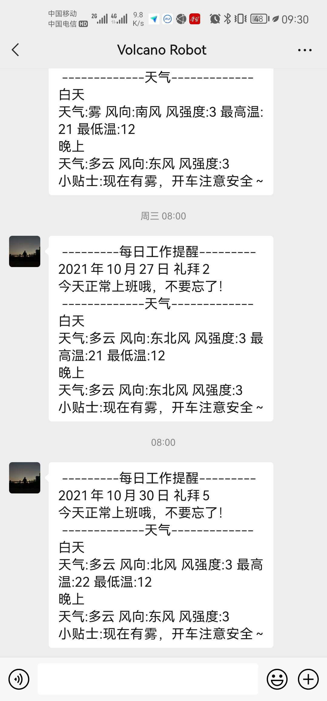
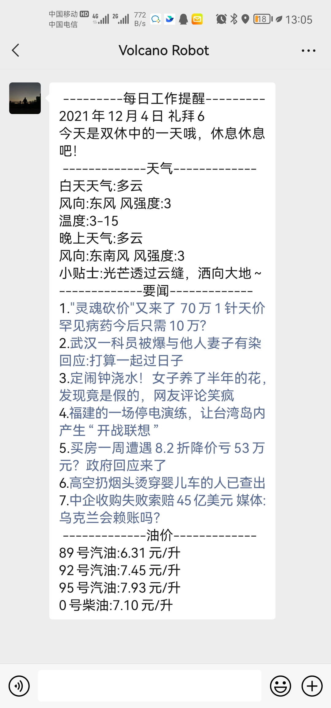

# WxSend

## 简介
项目博客地址：

该脚本可以通过使用企业微信API推送消息至微信上

| 脚本       | 介绍                 |
| ---------- | -------------------- |
| Holiday.py | 计算节假日           |
| Pylog.py   | Log内容输出          |
| Weather.py | 获取天气信息         |
| WxPost.py  | 企业微信Api          |
| Run.py     | 主要运行的文件       |
| News.py    | 获取网易新闻每日要闻 |
| CityOil.py | 获取城市油价         |

当前可以整合节假日信息、天气信息输出至微信。效果如下所示：

v0.1

v1.0

## 修改历史

2021.12.04 

1. 修改天气输出格式
2. 修改pylog注释
3. 添加油价查询 CityOil.py

